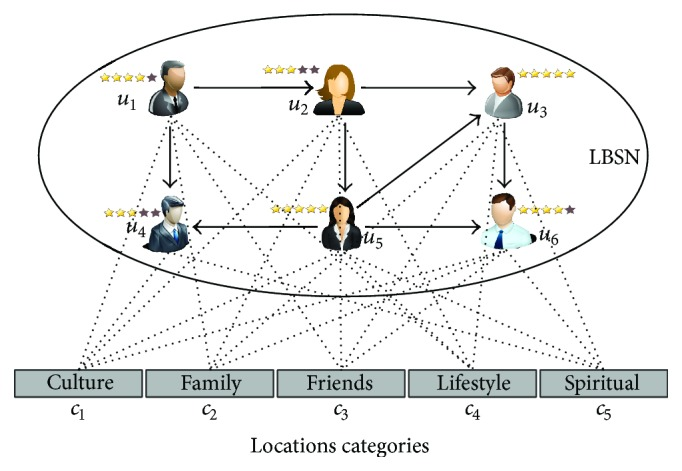

Prof. Andy Catlin
IS 643 - Special Topics: Recommender Systems
Department of Data Analytics, City University of New York

#Recommendation systems for location-based social networks 

Recommendation system usually recommend or produce recommendation either by collaborative or content based filtering.
A social network is an abstract structure comprised of individuals connected by one or more types of relations, such as friendship, shared knowledge, and common interests. 
Adding location data strengthens connections with social networks.

Location can be presented in relative, absolute, or symbolic form. Location is usually represented geographical as a point location, a region, and a trajectory.

Web-based social networks consists of online communities of people, organizations or other social entities that are connected by social relationships, such as friendships, colleagues or information exchange in varied contexts e.g.entertainment, religion, dating, or business.

The efficiency of recommendation systems can be significantly improved by using location data to filter out irrelevant information. Most recommendation systems in Location Based Social Network currently use only one type of data source to make recommendations.

###Social network application environments are divided into following groups: 

1. Friendly environments where people mostly chat or share ideas. 
2. Business environments where users perform business tasks as sellers or costumers. 
3. General environments which are formed in order to discuss and share information and create knowledge. 
4. Compound environment where there is a combination of friendly environment and business or scientific environment users. 

###The Location Based Social Networks have three unique properties 
1.	The heterogeneous domain
2.	The rate of growth
3.	Location Context Awareness

